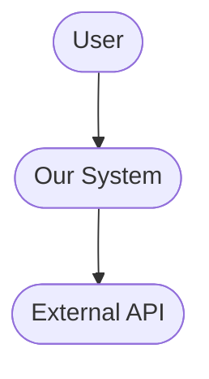
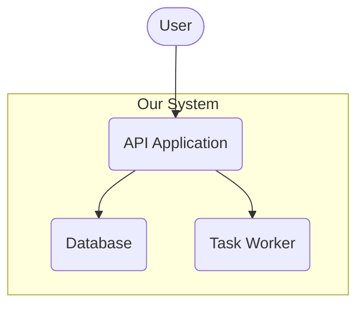
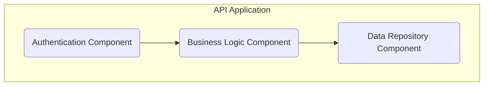

```markdown
# System Design: [Project Name]

This document outlines the system architecture for [Project Name]. It follows the C4 model to describe the system at various levels of abstraction and documents the key technical decisions and guiding architectural principles.

## 1. Architecture Decisions

_[This section comes first to provide context for the diagrams that follow.]_

### 1.1. Technology Stack
*   **Programming Language(s):** [e.g., Python]
*   **Major Frameworks/Libraries:** [e.g., FastAPI, SQLAlchemy]
*   **Database:** [e.g., PostgreSQL]
*   **Deployment Environment:** [e.g., Docker Container on AWS Fargate]

### 1.2. Key Design Decisions
_[This is for significant choices that shape the architecture. Think of these as Architecture Decision Records (ADRs).]_

*   **Decision:** Use of an Asynchronous Task Queue.
    *   **Rationale:** To handle long-running background processes without blocking the main API, improving user-facing response times. This supports our performance goals.
    *   **Alternatives Considered:** In-process background tasks (rejected due to scalability limitations).

## 2. System Architecture (C4 Model)

### 2.1. Level 1: System Context
_[This diagram shows the system as a single box and its relationships with users and other systems.]_

**Diagram:**


**Description:**
*   **User:** [Describes who uses the system.]
*   **Our System:** [A brief, one-sentence description of the system's core purpose.]
*   **External API:** [Describes the external dependency.]

### 2.2. Level 2: Containers
_[This diagram zooms into the "Our System" box, showing the high-level technical building blocks like applications, databases, message queues, etc.]_

**Diagram:**


**Container Descriptions:**
*   **API Application:** [e.g., A Python FastAPI application serving user requests.]
*   **Database:** [e.g., A PostgreSQL database storing all persistent data.]
*   **Task Worker:** [e.g., A Celery worker process that executes background jobs.]

### 2.3. Level 3: Components
_[This section can be repeated for each container, zooming in to show the major internal components/modules.]_

**Container: API Application**

**Component Diagram:**

**Component Descriptions:**
*   **Authentication Component:** Handles user login, authentication, and authorization.
*   **Business Logic Component:** Implements the core features and use cases.
*   **Data Repository Component:** Provides an abstraction layer for database interactions, promoting the DRY principle.

### 2.4. Data Flow
_[Describes how data moves through the containers and components for a key use case.]_

**Use Case: User Registration**
1.  The User sends registration data to the **API Application**.
2.  The **Authentication Component** validates the data.
3.  The **Business Logic Component** creates a new user entity.
4.  The **Data Repository Component** persists the new user in the **Database**.

## 3. Design Patterns
*   **Repository Pattern:** Used in the Data Repository Component to decouple business logic from data access logic, which supports SOLID principles.
*   **Observer Pattern:** Used to notify different parts of the system when a key event occurs.

## 4. Architectural Principles & Considerations (NFRs)
*   **Performance:** The system must have a median API response time under 200ms.
*   **Scalability:** The API Application and Task Workers are designed as stateless services that can be horizontally scaled.
*   **Security:** All user data will be encrypted at rest. API endpoints will be protected via JWT authentication.
*   **Maintainability:** The architecture's adherence to SOLID principles via component-based design will ensure maintainability.
*   **Logging and Monitoring:**
    *   **Logging:** All services will output structured (JSON) logs. Log levels will be configurable.
    *   **Monitoring:** Key metrics (e.g., request latency, error rates, queue depth) will be exposed via a `/metrics` endpoint for collection by a monitoring system.