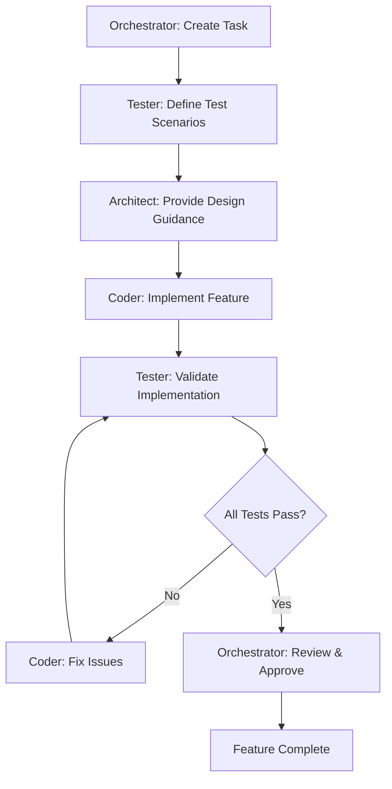
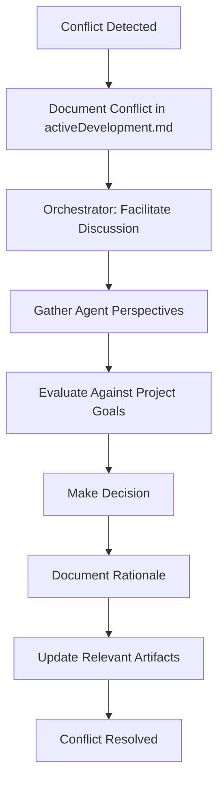

## Interaction Workflows

The DAC framework defines specific workflows for agent collaboration, ensuring consistent communication patterns and quality gates throughout the development process.

### Feature Development Workflow

This is the primary workflow for implementing new features, involving all four agents in a structured sequence:

**Detailed Steps:**

1. **Task Creation (Orchestrator)**
   - Links task to specific user story in projectContext.md
   - Defines clear acceptance criteria
   - Assigns priority and estimates
   - Logs entry in activeDevelopment.md

2. **Test Definition (Tester)**
   - Reviews acceptance criteria for testability
   - Defines comprehensive test scenarios (unit, integration, e2e)
   - Documents test cases in activeDevelopment.md
   - Validates requirements are measurable

3. **Design Guidance (Architect)**
   - Reviews task against systemDesign.md
   - Provides implementation guidance
   - Identifies architectural considerations
   - Documents guidance in activeDevelopment.md

4. **Implementation (Coder)**
   - Follows TDD cycle: Red → Green → Refactor
   - Makes atomic commits with clear messages
   - Updates activeDevelopment.md with progress
   - Links commits to task IDs

5. **Validation (Tester)**
   - Runs all test scenarios
   - Verifies acceptance criteria are met
   - Documents test results
   - Reports any issues found

6. **Review & Approval (Orchestrator)**
   - Verifies all quality gates passed
   - Confirms alignment with project goals
   - Approves for integration
   - Updates project status

### Conflict Resolution Workflow

When agents disagree or conflicts arise, this workflow ensures systematic resolution:

### Quality Gate Checkpoints

Each workflow includes mandatory quality gates that must be satisfied before progression:

**Pre-Implementation Gates:**
- [ ] Task linked to projectContext.md requirement
- [ ] Test scenarios defined and approved
- [ ] Architectural guidance provided
- [ ] All dependencies resolved

**Pre-Integration Gates:**
- [ ] All tests passing
- [ ] Code review completed
- [ ] Documentation updated
- [ ] Acceptance criteria verified

**Pre-Release Gates:**
- [ ] All features tested end-to-end
- [ ] Performance requirements met
- [ ] Security review completed
- [ ] Deployment plan validated

---

## Quality Gates & Validation

The DAC framework implements systematic quality controls to ensure consistent output and minimize non-deterministic behavior.

### Cross-Artifact Consistency Validation

**Automated Checks:**
- Verify all tasks in activeDevelopment.md link to projectContext.md requirements
- Ensure systemDesign.md addresses all constraints in projectContext.md
- Validate that implementation decisions align with architectural guidance

**Manual Review Process:**
- Orchestrator reviews systemDesign.md against project goals
- Architect validates implementation against design principles
- Tester confirms all requirements are testable and measured

### Agent Performance Metrics

**Quality Indicators:**
- **Orchestrator**: % of tasks with clear traceability to requirements
- **Architect**: % of designs that pass implementation without major changes
- **Tester**: % of bugs caught before production deployment
- **Coder**: % of commits that pass all tests on first attempt

**Continuous Improvement Triggers:**
- Weekly retrospectives on workflow effectiveness
- Monthly review of quality metrics and trends
- Quarterly assessment of framework evolution needs

### Error Handling Protocols

**Common Scenarios and Responses:**

| Scenario | Detection | Response | Prevention |
|----------|-----------|----------|------------|
| Conflicting requirements | Architect/Tester review | Orchestrator facilitates resolution | Better initial requirements analysis |
| Design-implementation mismatch | Code review failure | Architect provides clarification | More detailed design guidance |
| Test coverage gaps | Automated coverage reports | Tester defines additional tests | Stricter pre-implementation review |
| Scope creep | Orchestrator monitoring | Reject or formal change request | Clear out-of-scope documentation |

### Rollback Procedures

**When Quality Gates Fail:**
1. **Immediate**: Halt progression to next phase
2. **Document**: Log failure reason in activeDevelopment.md
3. **Analyze**: Identify root cause and prevention measures
4. **Remediate**: Address issues before proceeding
5. **Validate**: Re-run quality gates before continuation

---